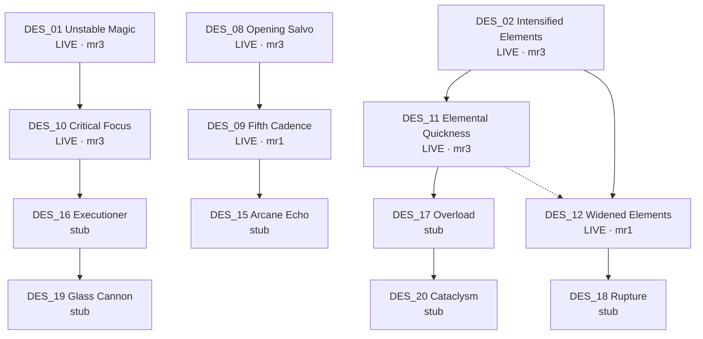

# Talent tree design board

Scratchpad for designing talent rows before promoting them in `packages/shared/src/talentCatalog.ts`.

**Source of truth:** catalog + `layoutTalentTree` / `talentTreeLinks` (4 columns, centered chunks per tier).  
**Live combat:** only rows marked **LIVE** are wired through `resolveKit` / combat.

---

## Legend

| Mark | Meaning |
| --- | --- |
| **LIVE** | `implemented: true` — works in combat |
| stub | Visible in UI as not implemented |
| hidden | Not shown (retired placeholders) |
| `mrN` | Max ranks |
| `→` | Prerequisite / visual rail (parent must have ≥1 point) |
| `⇢` | Authored same-row require (`requires: [...]`) |

**Budget:** 31 total points · **18** per tree · **40** essence / point · tier gates: T2 needs 3–4 in-tree, T3 needs 8, T4 needs 12.

**Layout rules (important for design):**

1. Talents in the same `tier` fill a visual row left→right by `layoutOrder` (then id), centered in 4 columns.
2. If a tier has >4 talents, it wraps to another visual row.
3. Vertical rails auto-link each node to the **nearest** parent on the previous visual row.
4. Extra same-row gates use `requires: ["PARENT_ID"]` (drawn as a horizontal rail).

---

## Destruction (furthest along)

```
Visual row 0 — Tier 1 (need 0)
 col0                    col1                    col2                    col3
┌──────────────────┐   ┌──────────────────┐   ┌──────────────────┐
│ DES_08 LIVE mr3  │   │ DES_01 LIVE mr3  │   │ DES_02 LIVE mr3  │
│ Opening Salvo    │   │ Unstable Magic   │   │ Intensified      │
│ +8% open dmg     │   │ +9% crit dmg     │   │ Elements +15%    │
└────────┬─────────┘   └────────┬─────────┘   └────────┬─────────┘
         │                      │                      │
         ▼                      ▼                      ▼
Visual row 1 — Tier 2 (need 3 in-tree)
┌──────────────────┐   ┌──────────────────┐   ┌──────────────────┐   ┌──────────────────┐
│ DES_09 LIVE mr1  │   │ DES_10 LIVE mr3  │   │ DES_11 LIVE mr3  │   │ DES_12 LIVE mr1  │
│ Fifth Cadence    │   │ Critical Focus   │   │ Elemental        │   │ Widened Elements │
│ +15% every 5th   │   │ +2/4/6% crit     │   │ Quickness        │   │ +10% elem AoE    │
│                  │   │                  │   │ −5/10/15% CD     │   │ ⇢ requires DES_11│
└────────┬─────────┘   └────────┬─────────┘   └────────┬─────────┘   └────────┬─────────┘
         │                      │                      │                      │
         ▼                      ▼                      ▼                      ▼
Visual row 2 — Tier 3 (need 8)  [STUB]
┌──────────────────┐   ┌──────────────────┐   ┌──────────────────┐   ┌──────────────────┐
│ DES_15 stub mr1  │   │ DES_16 stub mr1  │   │ DES_17 stub mr1  │   │ DES_18 stub mr1  │
│ Arcane Echo      │   │ Executioner      │   │ Overload         │   │ Rupture          │
└────────┬─────────┘   └────────┬─────────┘   └────────┬─────────┘   └────────┬─────────┘
         │                      │                      │                      │
         │                      ▼                      ▼                      │
Visual row 3 — Tier 4 keystones (need 12)  [STUB]
                   ┌──────────────────┐   ┌──────────────────┐
                   │ DES_19 stub mr1  │   │ DES_20 stub mr1  │
                   │ Glass Cannon     │   │ Cataclysm        │
                   └──────────────────┘   └──────────────────┘
```

### Destruction — effects cheat sheet

| ID | Name | Status | Effect (at max rank) |
| --- | --- | --- | --- |
| DES_08 | Opening Salvo | LIVE | Initiate combat: +8% dmg (8s CD) |
| DES_01 | Unstable Magic | LIVE | Crits deal +9% more dmg |
| DES_02 | Intensified Elements | LIVE | Elemental secondaries +15% |
| DES_09 | Fifth Cadence | LIVE | Every 5th damaging spell +15% |
| DES_10 | Critical Focus | LIVE | Crit chance +6% |
| DES_11 | Elemental Quickness | LIVE | Elemental CD −15% |
| DES_12 | Widened Elements | LIVE | Elemental AoE radius +10% (needs DES_11) |
| DES_15 | Arcane Echo | stub | 4th projectile echoes @ 60% |
| DES_16 | Executioner | stub | +10% vs &lt;25% HP |
| DES_17 | Overload | stub | 3 different slots → 12% haste 3s |
| DES_18 | Rupture | stub | 3 mechanics → Vulnerable +7% |
| DES_19 | Glass Cannon | stub | +15% dmg / −12% HP / −8% heal taken |
| DES_20 | Cataclysm | stub | Every 18s next AoE +25% r / +12% dmg |

### Destruction — design scratch (next row ideas)

```
Visual row ? — Tier ?
 col0                    col1                    col2                    col3
┌──────────────────┐   ┌──────────────────┐   ┌──────────────────┐   ┌──────────────────┐
│                  │   │                  │   │                  │   │                  │
│                  │   │                  │   │                  │   │                  │
└──────────────────┘   └──────────────────┘   └──────────────────┘   └──────────────────┘

Links (parent → child):
- 
- 

Notes:
- 
```

---

## Guardian

```
R0 T1  [GUA_08 LIVE Protective Instinct] [GUA_01 Thick Skin] [GUA_02 Unshaken] [GUA_03 Recovery]
         │                    │                   │                  │
R1 T1  [GUA_04 Brace]       [GUA_05 Lasting Guard] [GUA_06 Steadfast] [GUA_07 Emergency Step]
         │                    │                   │                  │
R2 T2  [GUA_09 Reinforced]  [GUA_10 Iron Will]   [GUA_11 Reflective] [GUA_12 Delayed Pain]
                              │                   │
R3 T2                       [GUA_13 Counterguard] [GUA_14 Grounded]
                              │╲                 ╱│
R4 T3  [GUA_15 Last Stand]  [GUA_16 Hardened] [GUA_17 Shared Bulwark] [GUA_18 Challenge]
                              │                   │
R5 T4                       [GUA_19 Living Fortress] [GUA_20 Unbreakable]
```

| ID | Name | Status | Effect |
| --- | --- | --- | --- |
| GUA_08 | Protective Instinct | LIVE | Defense cast → nearest ally 2/4/6% DR 3s |
| GUA_01 | Thick Skin | stub | DoT taken −15% |
| GUA_02 | Unshaken | stub | Displacement received −25% |
| GUA_03 | Recovery | stub | After 5s OOC: regen 1.25% HP/s |
| GUA_04 | Brace | stub | −8% dmg while casting/channeling |
| GUA_05 | Lasting Guard | stub | Shields on you +25% duration |
| GUA_06 | Steadfast | stub | Above 70% HP: 5% DR |
| GUA_07 | Emergency Step | stub | Move spell &lt;35% HP → 5% HP shield |
| GUA_09–20 | (see catalog) | stub | Tier 2–4 defenses / keystones |

---

## Control

```
R0 T1  [CON_03 LIVE Opportunist] [CON_01 Lasting Effects] [CON_02 Tactical Vision] [CON_04 Sticky Ground]
R1 T1  [CON_05 Suppressive]      [CON_06 Spatial]         [CON_07 Crippling Chill]  [CON_08 Watchful]
R2 T2  [CON_09 Frozen Momentum]  [CON_10 Crushing Force]  [CON_11 Unstable Ground]  [CON_12 Silencing]
R3 T2                            [CON_13 No Escape]       [CON_14 Control Chain]
R4 T3  [CON_15 Tactical Reset]   [CON_16 Interrupt Master][CON_17 Zone Mastery]     [CON_18 Diminishing]
R5 T4                            [CON_19 Domination]      [CON_20 Time Lock]
```

| ID | Name | Status | Effect |
| --- | --- | --- | --- |
| CON_03 | Opportunist | LIVE | +2/4/6% dmg vs your stun/root/silence |
| CON_01–20 | (see catalog) | mostly stub | Control / reveal / zone / keystones |

---

## Flow

```
R0 T1  [FLO_01 LIVE Sprinter] [FLO_02 Spell Rhythm] [FLO_03 Resource Cycle] [FLO_04 Fluid Casting]
R1 T1  [FLO_05 Quick Recovery][FLO_06 Close the Gap][FLO_07 Evasive Casting][FLO_08 Efficient Seq]
R2 T2  [FLO_09 Afterimage]    [FLO_10 Combo Engine] [FLO_11 Chaser]         [FLO_12 Slipstream]
R3 T2                         [FLO_13 Adaptive]     [FLO_14 Overflowing Energy]
R4 T3  [FLO_15 Adrenaline]    [FLO_16 Phase Step]   [FLO_17 Tempo Shift]    [FLO_18 Arcane Momentum]
R5 T4                         [FLO_19 Perfect Flow] [FLO_20 Untouchable Rhythm]
```

| ID | Name | Status | Effect |
| --- | --- | --- | --- |
| FLO_01 | Sprinter | LIVE | Move speed +2/4/6% |
| FLO_02–20 | (see catalog) | mostly stub | Tempo / mobility / keystones |

---

## Harmony

```
R0 T1  [HAR_01 LIVE Overflow] [HAR_02 Encouragement] [HAR_03 Shared Strength] [HAR_04 Spiritual Focus]
R1 T1  [HAR_05 Lingering Care][HAR_06 Gentle Current][HAR_07 Mutual Aid]      [HAR_08 Battlefield Medic]
R2 T2  [HAR_09 Guardian Angel][HAR_10 Purification]  [HAR_11 Resonance]       [HAR_12 Protective Bloom]
R3 T2                         [HAR_13 Inspiration]   [HAR_14 Life Link]
R4 T3  [HAR_15 Shared Recovery][HAR_16 Bolstering]   [HAR_17 Clean Momentum]  [HAR_18 Empowered Support]
R5 T4                         [HAR_19 Divine Resonance][HAR_20 Circle of Life]
```

| ID | Name | Status | Effect |
| --- | --- | --- | --- |
| HAR_01 | Overflow | LIVE | Overheal → shield (scales convert + cap) |
| HAR_02–20 | (see catalog) | mostly stub | Support / cleanse / keystones |

---

## Blank tree template (copy for a new row)

```
Tree: _____________    Tier: ___    Visual row: ___    In-tree points needed: ___

 col0                    col1                    col2                    col3
┌──────────────────┐   ┌──────────────────┐   ┌──────────────────┐   ┌──────────────────┐
│ ID:              │   │ ID:              │   │ ID:              │   │ ID:              │
│ Name:            │   │ Name:            │   │ Name:            │   │ Name:            │
│ Ranks:           │   │ Ranks:           │   │ Ranks:           │   │ Ranks:           │
│ Parent:          │   │ Parent:          │   │ Parent:          │   │ Parent:          │
│ Effect:          │   │ Effect:          │   │ Effect:          │   │ Effect:          │
│                  │   │                  │   │                  │   │                  │
└──────────────────┘   └──────────────────┘   └──────────────────┘   └──────────────────┘

Same-row requires (optional):  ________ → ________

Tags / spell family: ________________________________

Balance notes: _______________________________________

Combat hooks to wire:
- [ ] talentCatalog entry (`implemented: true` when done)
- [ ] resolveKit bake
- [ ] CombatSystem / StatusSystem
- [ ] HUD / spellbar (if player-facing tracker)
```

---

## Mermaid — Destruction live path



---

## How to keep this file useful

1. Sketch new nodes in the **scratch** / **blank template** sections first.
2. When happy, add them to `talentCatalog.ts` with `tier`, `layoutOrder`, `requires`, `exactEffect`.
3. Flip `implemented: true` only after kit + combat hooks exist.
4. Re-check in-game tree UI — rails follow nearest previous-row parent + `requires`.

Catalog code: [`packages/shared/src/talentCatalog.ts`](../packages/shared/src/talentCatalog.ts) · layout: [`packages/shared/src/talentTrees.ts`](../packages/shared/src/talentTrees.ts) · overview: [`docs/talents-and-progression.md`](./talents-and-progression.md)
