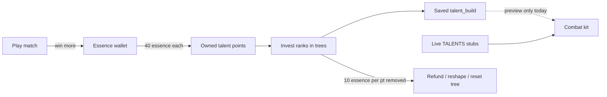

# Talents, spell tags & combat kit

Reference for the classless talent system, spell tags, and the combat modifier bake path. Use this when promoting catalog talents into live combat, tuning economy numbers, or extending the WoW-style tree UI.

---

## Design principles

1. **Essence unlocks / buys power budget; match power is capped.** Players earn essence, spend it on talent points (and resets). Equipped spend is capped so veterans do not infinitely outscale newer players.
2. **Catalog vs live.** The 100-talent workbook lives in `TALENT_CATALOG` as design-only. Combat currently applies only live stubs in `TALENTS` (`tough` / `swift` / `focused`) via `resolveKit`. Promote catalog entries one-by-one into live mods.
3. **Bake on change, never scan per tick.** Loadout + talents resolve into a `CombatSessionKit` on join / save. The 30 Hz combat tick reads the kit, not talent lists.
4. **Effect dispatch by `effectKind`, not ability id.** Special fire paths (`spikeWave`, `coneChannel`, `pulseHeal`, `decoy`) are declarative on `AbilityDef`.

Original workbook overview (historical): 5 trees, 100 talents, 20-point build / 12 per tree. **Live numbers were raised** so a deep single-tree path + multi-rank foundations can reach keystones — see constants below.

---

## Numbers (source of truth)

Defined in [`packages/shared/src/talentTrees.ts`](../packages/shared/src/talentTrees.ts):

| Constant | Value | Meaning |
| --- | --- | --- |
| `TALENT_POINT_BUDGET` | **31** | Max points that can be invested in a build |
| `TALENT_TREE_CAP` | **18** | Max points in one tree |
| `ESSENCE_PER_TALENT_POINT` | **40** | Essence → 1 owned talent point |
| `ESSENCE_PER_TALENT_REFUND` | **10** | Essence per invested point removed / reshaped / tree reset |
| `STARTER_TALENT_POINTS` | **10** | New / guest starting owned points |

Tier gates (points already in that tree):

| Tier | Required in-tree |
| --- | --- |
| 1 | 0 |
| 2 | 4 |
| 3 | 8 |
| 4 | 12 |

Keystone unlock helper: effective need is `min(requiredPoints, treeCap − rankCost)` so cost-3 keystones remain reachable under the tree cap.

### Match essence payouts

See [`docs/loot-and-rewards.md`](./loot-and-rewards.md) and `computeMatchReward` in `packages/shared/src/rewards.ts`. Win ≈ base + win-bonus essence (mode-scaled); copper bands replace fixed silver grants.

---

## Progression loop



1. Play matches → earn essence (more on wins).
2. Talent stand → **Buy 1 / Buy 5** points (`buy_talent_points`). Owned points cannot exceed `TALENT_POINT_BUDGET`.
3. Left-click nodes to invest ranks (up to `maxRank`); right-click refunds one rank (WoW-style order: cannot break remaining tier requirements).
4. **Save build** → `set_talent_build` persists `talent_build` JSON. Removing or reshaping points costs `pointsRemoved × ESSENCE_PER_TALENT_REFUND` (adds alone are free); UI confirms when a respec fee applies.
5. **Reset tree** clears that tree after confirm; same proportional rate for every point wiped.

Owned points are **not** consumed when investing — they are a ceiling. Respec frees build slots but does **not** refund essence spent on buying points (only the per-point respec fee). Helper: `talentPointsRemoved` / `talentRefundEssenceCost`.

---

## Multi-rank talents

- `pointCost` = cost **per rank**.
- `maxRank` optional on `CatalogTalentDef`.
- Default: **tier 1 && pointCost === 1 → maxRank 3**; otherwise **1**.
- Helpers: `talentMaxRank`, `talentRankCost`, `formatTalentEffectRanks`, `canInvestTalent`, …
- UI shows `rank/maxRank` on multi-rank nodes; tooltips show the **current** percent step if invested, otherwise the **first** step (e.g. rank 0 of `+6%` → `+2%`).

When promoting a multi-rank talent into live combat, bake magnitude × rank inside `resolveKit` (or per-ability effective defs), not in the tick loop.

---

## Trees & UI

| Tree id | Accent role |
| --- | --- |
| Destruction | Offense / projectile / explosion |
| Guardian | Defense / shields |
| Control | CC / lockdown |
| Flow | Tempo / movement / haste |
| Harmony | Healing / support |

- **UI:** [`apps/web/src/game/ui/TalentTreePanel.tsx`](../apps/web/src/game/ui/TalentTreePanel.tsx) (wired from talent stand in `StandPanel.tsx`).
- **Layout:** 4-column board via `layoutTalentTree` / `talentTreeLinks` (visual rails; not authored prerequisite edges yet).
- **Styles:** `.bb-talent-*` in [`apps/web/src/styles/game-hud.css`](../apps/web/src/styles/game-hud.css).
- **Nature icons:** [`TalentNatureIcon.tsx`](../apps/web/src/game/ui/TalentNatureIcon.tsx) maps primary `affectedTags` → Untitled UI icons on nodes + tooltip.
- **Catalog data:** [`packages/shared/src/talentCatalog.ts`](../packages/shared/src/talentCatalog.ts) (regen: `node scripts/gen-talent-catalog.mjs` from `.cursor/talent-catalog-extract.txt`).

Mutual exclusives called out in workbook balance notes (e.g. Heavy Projectiles vs Needlecast) are **not** enforced yet.

---

## Client ↔ server messages (hub)

| Message | Payload | Effect |
| --- | --- | --- |
| `buy_talent_points` | `{ count?: number }` | Spend essence, increase owned `talent_points` (clamped to budget) |
| `set_talent_build` | `{ build: Record<id, rank> }` | Validate / clamp / save; charge `talentRefundEssenceCost` for points removed vs previous build |
| `reset_talent_tree` | `{ tree: TalentTreeId }` | Clear that tree; cost = tree points × `ESSENCE_PER_TALENT_REFUND` |
| `set_talents` | `{ talentIds: string[] }` | **Live stubs only** (`tough` / `swift` / `focused`), max 2 — still drives combat kit HP/speed/CD |

Inventory push (`inventory`) includes:

```ts
resources: { copper, silver, gold, essence, talent_points }
loadout: string[]
talents: string[]           // live stub ids
talentBuild: TalentBuild    // catalog ranks
```

---

## Persistence

Migration: [`supabase/migrations/20260725000004_talent_progression.sql`](../supabase/migrations/20260725000004_talent_progression.sql)

- `talents.talent_build` — `jsonb` map `talentId → rank` (active/account mirror)
- `loadout_presets.talent_build` — per-preset talent ranks ([`20260729000000_loadout_preset_talent_build.sql`](../supabase/migrations/20260729000000_loadout_preset_talent_build.sql)); each loadout is spells + talents
- `inventory` row `resource_id = 'talent_points'`
- Seeds existing users with 10 talent points if missing

Selecting a loadout preset applies that slot’s `ability_ids` **and** `talent_build`. Saving talents writes to the **active** preset (and mirrors `talents.talent_build`).

Load/save: [`apps/game-server/src/persistence.ts`](../apps/game-server/src/persistence.ts) (`loadEconomy`, `saveInventory(..., talentPoints)`, `saveTalentBuild`, `saveLoadoutPreset`).

Guests keep progression in room memory only (not Supabase).

---

## Spell tags & effect kinds

### `SpellTag` / `AbilityDef.tags`

Tags live on each ability in [`packages/shared/src/abilities.ts`](../packages/shared/src/abilities.ts). Talent catalog `affectedTags` use the same vocabulary (workbook Tag Dictionary). Future live mods filter with `abilityHasTags` / tag lists on `TalentMod`.

### `AbilityEffectKind`

| Kind | Used by | Behavior |
| --- | --- | --- |
| `standard` | Most spells | Shape-driven projectile / melee / aoe / dash / buff |
| `spikeWave` | Spikes | Staggered ground pops |
| `coneChannel` | Frost Mist | Expanding cone ticks |
| `pulseHeal` | Groove | Channel heal pulses |
| `decoy` | Decoy | Clone + cloak at cast begin |

Server: `CombatSystem.fireEffect` → `abilityEffectKind(def)`.  
Client VFX bridges: `usesSpikeFx` / `usesFrostMistFx` / `usesGrooveFx` key off `effectKind`.

---

## Combat session kit

[`packages/shared/src/talentKit.ts`](../packages/shared/src/talentKit.ts) + `CombatSystem.syncSessionKit`:

```ts
type CombatSessionKit = {
  loadoutIds: Set<string>;
  talentIds: readonly string[];
  moveSpeedMul: number;
  maxHpBonus: number;
  cooldownMulByAbility: Map<string, number>;
};
```

- Rebuilt on hub join, `set_loadout`, `set_talents` (and should be rebuilt when catalog builds become combat-live).
- `tryBeginCast` uses `loadoutIds` (no CSV split on cast).
- Cooldown stamps use `kitCooldownMs`.
- Move speed multiplies kit `moveSpeedMul`.

Live stub mods today:

| Id | Mod |
| --- | --- |
| `tough` | `maxHp +100` (×10 combat magnitude) |
| `swift` | `moveSpeedMul × 1.08` |
| `focused` | `cooldownMul × 0.9` (all loadout abilities) |

### Hot-path notes (already in)

- Reused body / sim buffers; cached wall colliders; no Map spreads on travel/knockback/cast advances.
- Do not add per-tick talent scans or audio/VFX inside `CombatSystem.tick` — use `combat_fx` events.

---

## What is / is not live in combat

| Feature | Status |
| --- | --- |
| Tree UI, buy points, save/reset build | Live (hub) |
| Catalog talent combat effects | **Not live** until `implemented: true` + bake in `resolveKit` from `talentBuild` |
| **Opening Salvo (`DES_08`)** | **Live** — initiate-combat damage bonus (2.7 / 5.3 / 8%), **8s** CD (= leave-combat linger), disarmed if hit first |
| **Protective Instinct (`GUA_08`)** | **Live** — Defense cast → nearest ally (else self) **2% DR per rank** for **3s**, **6s** CD |
| **Opportunist (`CON_03`)** | **Live** — Damage spells deal **+2 / 4 / 6%** vs enemies under **your** hard CC (stun / root / silence) |
| **Sprinter (`FLO_01`)** | **Live** — Passive **+2 / 4 / 6%** movement speed |
| **Overflow (`HAR_01`)** | **Live** — Overheal → shield (**13.3/26.7/40%** convert, **2.7/5.3/8%** max-HP cap, **5s**) |
| WIP marker in tree UI | Nodes without `implemented: true` show **WIP** + tooltip note |
| `tough` / `swift` / `focused` | Live via stub `TALENTS` + `resolveKit` |
| Authored talent prerequisite links | Visual nearest-parent only |
| Essence / point economy | Live |

### Opening Salvo rules

- First node in Destruction (`layoutOrder: 0`).
- Bonus applies only when **initiating combat** (deal a Damage-tagged ability hit while out of combat).
- Being **hit first** or attacking while **already in combat** withholds the bonus until **leave combat** (**8s** linger — same as Opening Salvo CD / HP bar combat tint).
- Kit field: `CombatSessionKit.openingSalvoDmgBonus`; gate: `CombatSystem.applyRawDamage`.

### Protective Instinct rules

- First node in Guardian (`layoutOrder: 0`).
- Procs when a **Defense**-tagged ability's effect fires (Barrier, Hand Shield, Counter, Revenge, Dash, Protection Bubble, Groove, …).
- Grants `protectiveInstinct` resist buff: **2 / 4 / 6%** damage reduction for **3s** (rank 1–3).
- Target: nearest friendly player (cannot-hurt / same team / hub); if none, **self**.
- Kit field: `CombatSessionKit.protectiveInstinctReducePct`; internal CD **6s**.

### Opportunist rules

- First node in Control (`layoutOrder: 0`).
- Damaging spells (`Damage` tag, `damage > 0`) deal bonus damage to targets that currently have **your** hard CC.
- Hard CC = status mechanic `stun` / `root` / `silence` (e.g. stunned, rooted, chained, silenced) with `sourceId` = you. Slows / DoTs do not count.
- Kit field: `CombatSessionKit.opportunistDmgBonus` (2 / 4 / 6%); gate: `CombatSystem.applyRawDamage`.

### Sprinter rules

- First node in Flow (`layoutOrder: 0`, `FLO_01`).
- Passive movement speed: **+2 / 4 / 6%** at ranks 1–3.
- Multiplies into kit `CombatSessionKit.moveSpeedMul` (stacks with stub `swift` and status move mul).
- No proc / cooldown — always on while invested.

### Overflow rules

- First node in Harmony (`layoutOrder: 0`, `HAR_01`).
- When a **Healing** spell or **HoT** tick overheals (self or ally), **13.3 / 26.7 / 40%** of the wasted heal becomes `overflowShield` absorb for **5s**.
- Shield stacks from further overheals, refreshed to 5s, capped at **2.7 / 5.3 / 8%** of the target's max HP.
- Kit fields: `overflowConvertFrac`, `overflowCapFrac`; gate: `CombatSystem.applyHealAmount` (+ Groove self refund).

### Marking a talent implemented

On the catalog entry in `talentCatalog.ts`:

```ts
DES_08: {
  // ...
  implemented: true, // combat-ready
},
```

Omit or set `false` = design preview. Bake magnitude from `talentBuild` ranks in `resolveKit` (preferred for catalog talents) and/or add a live `TalentDef` in `stands.ts` for stub-style mods.

---

## Promoting a catalog talent (checklist)

1. Set `implemented: true` and final `exactEffect` text on the catalog entry.
2. Bake ranks into `CombatSessionKit` inside `resolveKit` (pass `talentBuild` from hub/match sync).
3. Apply behavior in the combat hot path (e.g. `applyRawDamage` / CD / status).
4. Call `syncSessionKit(..., talentBuild)` on save build, loadout select, and match join.
5. Restart game-server after shared changes.
6. Smoke-test: invest ranks, save, rejoin hub/match, confirm combat feel.

---

## Related files

| Area | Path |
| --- | --- |
| Catalog | `packages/shared/src/talentCatalog.ts` |
| Tree rules | `packages/shared/src/talentTrees.ts` |
| Kit bake | `packages/shared/src/talentKit.ts` |
| Live stubs | `packages/shared/src/stands.ts` |
| Abilities + tags | `packages/shared/src/abilities.ts` |
| Combat | `apps/game-server/src/combat/CombatSystem.ts` |
| Hub handlers | `apps/game-server/src/rooms/BaseCityRoom.ts` |
| Match loot | `apps/game-server/src/rooms/ContentRoom.ts` |
| Tree UI | `apps/web/src/game/ui/TalentTreePanel.tsx` |
| Workbook extract | `.cursor/talent-catalog-extract.txt` |
| Catalog regen | `scripts/gen-talent-catalog.mjs` |

---

## Future (not implemented)

- Sound channels off the combat tick (subscribe to `combat_fx` / `effectKind`).
- Essence permanently unlocking talent *nodes* vs only buying points (workbook “veteran toolbox” variant).
- Authored parent→child prerequisites and exclusive groups.
- Bitset tag masks if bake cost matters.
- Full 5-tree essence progression UI beyond the stand panel.
