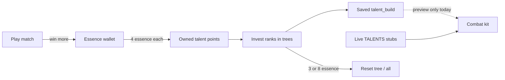

# Talents, spell tags & combat kit

Reference for the classless talent system, spell tags, and the combat modifier bake path. Use this when promoting catalog talents into live combat, tuning economy numbers, or extending the WoW-style tree UI.

---

## Design principles

1. **Essence unlocks / buys power budget; match power is capped.** Players earn essence, spend it on talent points (and resets). Equipped spend is capped so veterans do not infinitely outscale newer players.
2. **Catalog vs live.** The 100-talent workbook lives in `TALENT_CATALOG` as design-only. Combat currently applies only live stubs in `TALENTS` (`tough` / `swift` / `focused`) via `resolveKit`. Promote catalog entries one-by-one into live mods.
3. **Bake on change, never scan per tick.** Loadout + talents resolve into a `CombatSessionKit` on join / save. The 30 Hz combat tick reads the kit, not talent lists.
4. **Effect dispatch by `effectKind`, not ability id.** Special fire paths (`spikeWave`, `coneChannel`, `pulseHeal`, `decoy`) are declarative on `AbilityDef`.

Original workbook overview (historical): 5 trees, 100 talents, 20-point build / 12 per tree. **Live numbers were raised** so a deep single-tree path + multi-rank foundations can reach keystones — see constants below.

---

## Numbers (source of truth)

Defined in [`packages/shared/src/talentTrees.ts`](../packages/shared/src/talentTrees.ts):

| Constant | Value | Meaning |
| --- | --- | --- |
| `TALENT_POINT_BUDGET` | **31** | Max points that can be invested in a build |
| `TALENT_TREE_CAP` | **18** | Max points in one tree |
| `ESSENCE_PER_TALENT_POINT` | **4** | Essence → 1 owned talent point |
| `ESSENCE_RESET_TREE` | **3** | Cost to wipe one tree |
| `ESSENCE_RESET_ALL` | **8** | Cost to wipe entire build |
| `STARTER_TALENT_POINTS` | **10** | New / guest starting owned points |

Tier gates (points already in that tree):

| Tier | Required in-tree |
| --- | --- |
| 1 | 0 |
| 2 | 4 |
| 3 | 8 |
| 4 | 12 |

Keystone unlock helper: effective need is `min(requiredPoints, treeCap − rankCost)` so cost-3 keystones remain reachable under the tree cap.

### Match essence payouts (`MATCH_ESSENCE`)

Granted as pending loot when leaving content (`ContentRoom` → hub):

| Outcome | Essence |
| --- | --- |
| PvP win | 8 |
| PvP loss | 4 |
| PvP draw / unresolved end | 5 |
| PvP leave early (no finished match) | 2 |
| PvE return | 5 |

Plus coins (`copper` / `silver`) on the same grant.

---

## Progression loop



1. Play matches → earn essence (more on wins).
2. Talent stand → **Buy 1 / Buy 5** points (`buy_talent_points`). Owned points cannot exceed `TALENT_POINT_BUDGET`.
3. Left-click nodes to invest ranks (up to `maxRank`); right-click refunds one rank (WoW-style order: cannot break remaining tier requirements).
4. **Save build** → `set_talent_build` persists `talent_build` JSON.
5. **Reset tree** / **Clear all** charge essence server-side and persist empty / partial build.

Owned points are **not** consumed when investing — they are a ceiling. Resetting frees the build slots but does **not** refund essence spent on buying points (only the reset fee).

---

## Multi-rank talents

- `pointCost` = cost **per rank**.
- `maxRank` optional on `CatalogTalentDef`.
- Default: **tier 1 && pointCost === 1 → maxRank 3**; otherwise **1**.
- Helpers: `talentMaxRank`, `talentRankCost`, `formatTalentEffectRanks`, `canInvestTalent`, …
- UI shows `rank/maxRank` on multi-rank nodes; tooltips show the **current** percent step if invested, otherwise the **first** step (e.g. rank 0 of `+6%` → `+2%`).

When promoting a multi-rank talent into live combat, bake magnitude × rank inside `resolveKit` (or per-ability effective defs), not in the tick loop.

---

## Trees & UI

| Tree id | Accent role |
| --- | --- |
| Destruction | Offense / projectile / explosion |
| Guardian | Defense / shields |
| Control | CC / lockdown |
| Flow | Tempo / movement / haste |
| Harmony | Healing / support |

- **UI:** [`apps/web/src/game/ui/TalentTreePanel.tsx`](../apps/web/src/game/ui/TalentTreePanel.tsx) (wired from talent stand in `StandPanel.tsx`).
- **Layout:** 4-column board via `layoutTalentTree` / `talentTreeLinks` (visual rails; not authored prerequisite edges yet).
- **Styles:** `.bb-talent-*` in [`apps/web/src/styles/game-hud.css`](../apps/web/src/styles/game-hud.css).
- **Nature icons:** [`TalentNatureIcon.tsx`](../apps/web/src/game/ui/TalentNatureIcon.tsx) maps primary `affectedTags` → Untitled UI icons on nodes + tooltip.
- **Catalog data:** [`packages/shared/src/talentCatalog.ts`](../packages/shared/src/talentCatalog.ts) (regen: `node scripts/gen-talent-catalog.mjs` from `.cursor/talent-catalog-extract.txt`).

Mutual exclusives called out in workbook balance notes (e.g. Heavy Projectiles vs Needlecast) are **not** enforced yet.

---

## Client ↔ server messages (hub)

| Message | Payload | Effect |
| --- | --- | --- |
| `buy_talent_points` | `{ count?: number }` | Spend essence, increase owned `talent_points` (clamped to budget) |
| `set_talent_build` | `{ build: Record<id, rank> }` | Validate / clamp / save catalog build |
| `reset_talent_tree` | `{ tree: TalentTreeId }` | Cost `ESSENCE_RESET_TREE`, clear that tree |
| `reset_talent_build` | — | Cost `ESSENCE_RESET_ALL`, clear all ranks |
| `set_talents` | `{ talentIds: string[] }` | **Live stubs only** (`tough` / `swift` / `focused`), max 2 — still drives combat kit HP/speed/CD |

Inventory push (`inventory`) includes:

```ts
resources: { copper, silver, gold, essence, talent_points }
loadout: string[]
talents: string[]           // live stub ids
talentBuild: TalentBuild    // catalog ranks
```

---

## Persistence

Migration: [`supabase/migrations/20260725000004_talent_progression.sql`](../supabase/migrations/20260725000004_talent_progression.sql)

- `talents.talent_build` — `jsonb` map `talentId → rank`
- `inventory` row `resource_id = 'talent_points'`
- Seeds existing users with 10 talent points if missing

Load/save: [`apps/game-server/src/persistence.ts`](../apps/game-server/src/persistence.ts) (`loadEconomy`, `saveInventory(..., talentPoints)`, `saveTalentBuild`).

Guests keep progression in room memory only (not Supabase).

---

## Spell tags & effect kinds

### `SpellTag` / `AbilityDef.tags`

Tags live on each ability in [`packages/shared/src/abilities.ts`](../packages/shared/src/abilities.ts). Talent catalog `affectedTags` use the same vocabulary (workbook Tag Dictionary). Future live mods filter with `abilityHasTags` / tag lists on `TalentMod`.

### `AbilityEffectKind`

| Kind | Used by | Behavior |
| --- | --- | --- |
| `standard` | Most spells | Shape-driven projectile / melee / aoe / dash / buff |
| `spikeWave` | Spikes | Staggered ground pops |
| `coneChannel` | Frost Mist | Expanding cone ticks |
| `pulseHeal` | Groove | Channel heal pulses |
| `decoy` | Decoy | Clone + cloak at cast begin |

Server: `CombatSystem.fireEffect` → `abilityEffectKind(def)`.  
Client VFX bridges: `usesSpikeFx` / `usesFrostMistFx` / `usesGrooveFx` key off `effectKind`.

---

## Combat session kit

[`packages/shared/src/talentKit.ts`](../packages/shared/src/talentKit.ts) + `CombatSystem.syncSessionKit`:

```ts
type CombatSessionKit = {
  loadoutIds: Set<string>;
  talentIds: readonly string[];
  moveSpeedMul: number;
  maxHpBonus: number;
  cooldownMulByAbility: Map<string, number>;
};
```

- Rebuilt on hub join, `set_loadout`, `set_talents` (and should be rebuilt when catalog builds become combat-live).
- `tryBeginCast` uses `loadoutIds` (no CSV split on cast).
- Cooldown stamps use `kitCooldownMs`.
- Move speed multiplies kit `moveSpeedMul`.

Live stub mods today:

| Id | Mod |
| --- | --- |
| `tough` | `maxHp +10` |
| `swift` | `moveSpeedMul × 1.08` |
| `focused` | `cooldownMul × 0.9` (all loadout abilities) |

### Hot-path notes (already in)

- Reused body / sim buffers; cached wall colliders; no Map spreads on travel/knockback/cast advances.
- Do not add per-tick talent scans or audio/VFX inside `CombatSystem.tick` — use `combat_fx` events.

---

## What is / is not live in combat

| Feature | Status |
| --- | --- |
| Tree UI, buy points, save/reset build | Live (hub) |
| Catalog talent combat effects | **Not live** until `implemented: true` on the catalog entry + `resolveKit` wiring |
| WIP marker in tree UI | Nodes without `implemented: true` show **WIP** + tooltip note |
| `tough` / `swift` / `focused` | Live via `resolveKit` |
| Authored talent prerequisite links | Visual nearest-parent only |
| Essence / point economy | Live |

### Marking a talent implemented

On the catalog entry in `talentCatalog.ts`:

```ts
DES_01: {
  // ...
  implemented: true, // combat-ready
},
```

Omit or set `false` = design preview (default for all 100 today). Also add live `TalentMod` bake in `resolveKit` / `TALENTS` when shipping combat behavior.

---

## Promoting a catalog talent (checklist)

1. Add or extend a live `TalentDef` in `stands.ts` with typed `TalentMod`(s); set `status: "live"`.
2. Implement bake logic in `resolveKit` (player sheet and/or per-ability, tag-filtered).
3. Optionally remove/keep the catalog entry (`status: "catalog"` stays for reference).
4. Wire build → combat: map saved `talent_build` ranks into kit on sync (replace or complement stub `talent_ids`).
5. Restart game-server after shared changes.
6. Smoke-test: invest ranks, save, rejoin hub, confirm HP/speed/CD/combat feel.

---

## Related files

| Area | Path |
| --- | --- |
| Catalog | `packages/shared/src/talentCatalog.ts` |
| Tree rules | `packages/shared/src/talentTrees.ts` |
| Kit bake | `packages/shared/src/talentKit.ts` |
| Live stubs | `packages/shared/src/stands.ts` |
| Abilities + tags | `packages/shared/src/abilities.ts` |
| Combat | `apps/game-server/src/combat/CombatSystem.ts` |
| Hub handlers | `apps/game-server/src/rooms/BaseCityRoom.ts` |
| Match loot | `apps/game-server/src/rooms/ContentRoom.ts` |
| Tree UI | `apps/web/src/game/ui/TalentTreePanel.tsx` |
| Workbook extract | `.cursor/talent-catalog-extract.txt` |
| Catalog regen | `scripts/gen-talent-catalog.mjs` |

---

## Future (not implemented)

- Sound channels off the combat tick (subscribe to `combat_fx` / `effectKind`).
- Essence permanently unlocking talent *nodes* vs only buying points (workbook “veteran toolbox” variant).
- Authored parent→child prerequisites and exclusive groups.
- Bitset tag masks if bake cost matters.
- Full 5-tree essence progression UI beyond the stand panel.
